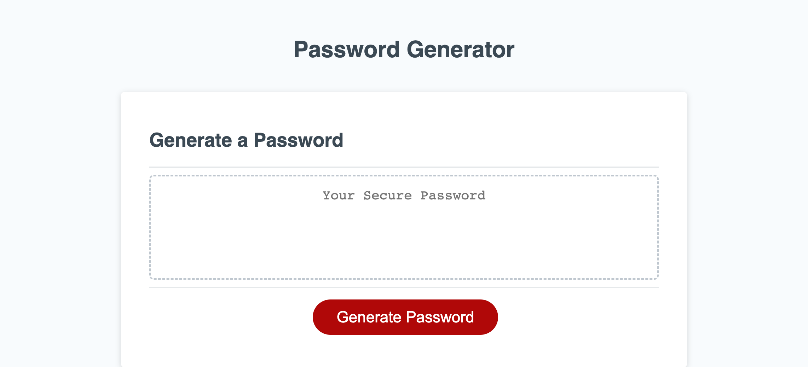

# Password-Website

## Description

The Random Password Generator is a powerful and user-friendly web application designed to generate secure and unique passwords on demand. With increasing concerns about online security, having strong passwords for different accounts is essential to protect your personal information. This website offers a convenient solution by allowing users to quickly generate passwords that are complex, random, and difficult to guess.

## Display

## Installation

N/A

## Usage

[Visit the Page](https://justinryan8828.github.io/Password-Website/)
